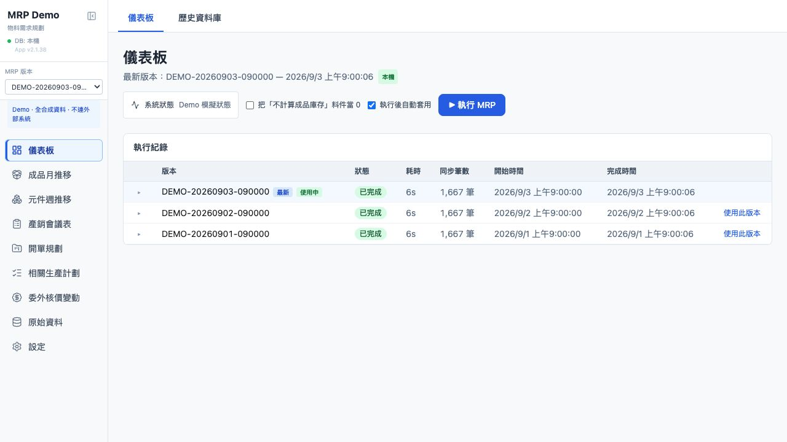
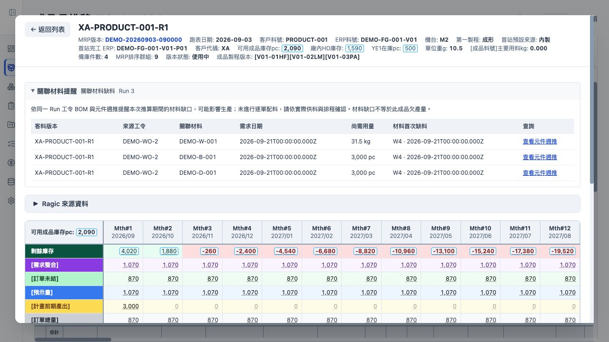
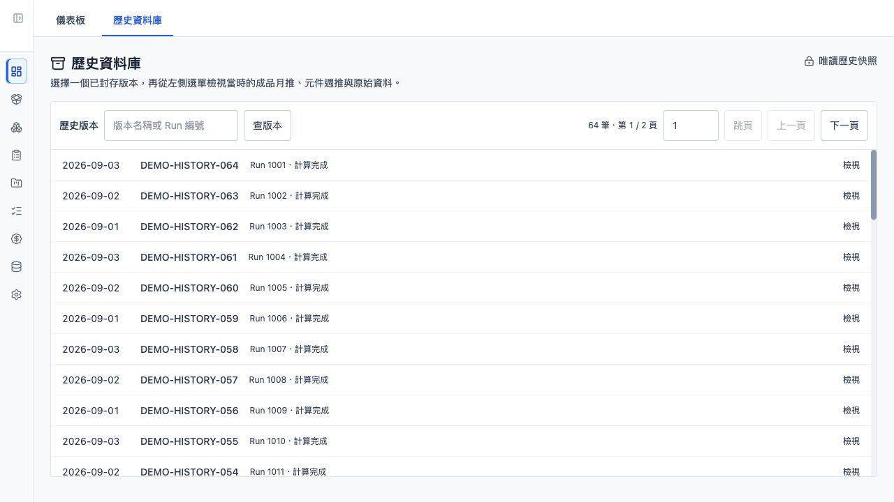

# MRP Demo

將訂單、預示量、庫存、工令、BOM 與採購資料，整合成可追溯、可版本化的生產與物料需求規劃系統。

這個 Demo 保留原有 MRP 計算引擎、報表與主要操作流程，所有資料均為合成資料，不需要公司資料庫或 Source 帳號。目前同步版本：**2.1.38**。



## 為什麼需要 MRP？

生產規劃必須同時判斷現有庫存是否足夠、何時會缺貨、需要生產或採購多少，以及結果來自哪一版資料。當訂單、預示、工令、BOM、庫存與採購分散在不同來源時，人工比對不只耗時，也難以處理共享庫存、領退料與歷史追溯。

本系統把來源資料固定在一個版本化的 **MRP Run**，再產生成品月推、元件週推、產銷分析與生產建議，讓每個結果都能回到同一版輸入查證。

## 可以展示什麼？

- 執行、暫停、停止、續算及切換 MRP Run。
- 成品月推：庫存、訂單、預示、生產計畫、第一製程與首站預設來源。
- 元件週推：材料缺口、採購前置期、領料、耗用與退料。
- 開單規劃、轉單、對帳與工令／BOM 回饋下一版 MRP。
- 唯讀歷史版本、來源追溯，以及寬表的列／欄雙軸虛擬化。

## 最快開啟

需要 [Node.js 24 LTS](https://nodejs.org/)；不需要 PostgreSQL、Docker、`.env` 或公司帳號。

**Windows：**下載或 clone 後直接雙擊 `Start-Demo.cmd`。首次執行會自動安裝、建置並開啟瀏覽器；之後可直接啟動。

**macOS／Linux：**

```bash
npm ci
npm run build
npm start
```

開啟 <http://127.0.0.1:3000>。完整準備、重設與展示案例請看 [Demo 操作指南](docs/demo-guide.md)。

## 3 分鐘展示流程

| 步驟 | 操作 | 重點 |
| --- | --- | --- |
| 1 | 儀表板執行一次 MRP | 版本化 Run、進度與執行生命週期 |
| 2 | 成品月推搜尋 `PRODUCT-001` | 月度供需、共享 ERP 庫存、第一製程與首站來源 |
| 3 | 點選「材料缺口」 | 從成品追到來源工令、BOM、剩餘用量與缺料週 |
| 4 | 元件週推搜尋 `DEMO-W-001` | 材料缺口與較晚到貨的採購單 |
| 5 | 儀表板切到「歷史資料庫」 | 固定版本、唯讀查詢與舊資料缺欄位處理 |



成品月推可直接展開同一 Run 的關聯材料，查看來源工令、尚需用量與首次缺料週。



歷史畫面只讀取當時快照，不用目前主檔補寫舊結果。

## 技術重點

- Next.js 15、React 19、TypeScript、Prisma 6、PostgreSQL。
- 版本化計算輸入、同 ERP 共享庫存與可重播的月／週推算。
- 來源身分與 `unknown` 語意：證據不足時不製造成功狀態。
- 大型寬表的雙軸虛擬化、固定欄、篩選、排序、框選與匯出。
- Linux／Windows CI、HTTP smoke，以及獨立的真實 PostgreSQL contract tests。

## Demo 邊界

- 不包含公司資料、`.env`、備份、帳密、session 或正式部署腳本。
- 不連正式 PostgreSQL、Source、SMTP 或公司內部服務。
- 所有寫入只改變本機合成狀態；歷史版本維持唯讀。
- 這是本機面試 Demo，不應直接當成公開 production 服務。

深入資料流、隔離方式與可驗證範圍請看 [技術展示與驗證](docs/technology-evidence.md)；CI 狀態請核對對應 commit 的 [GitHub Actions](https://github.com/moonking60144-collab/MRP-demo/actions)。
